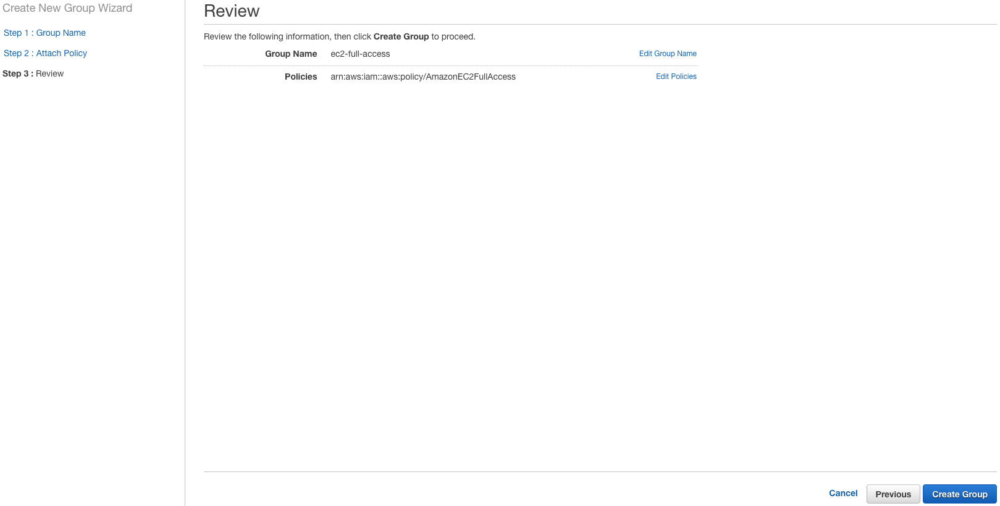
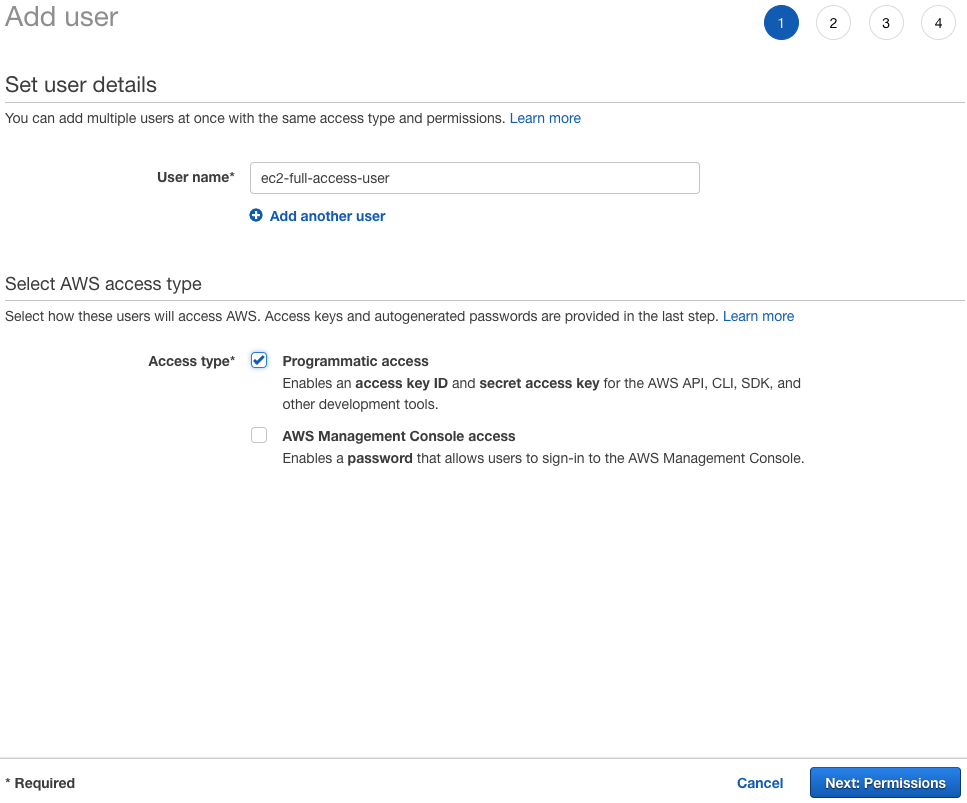
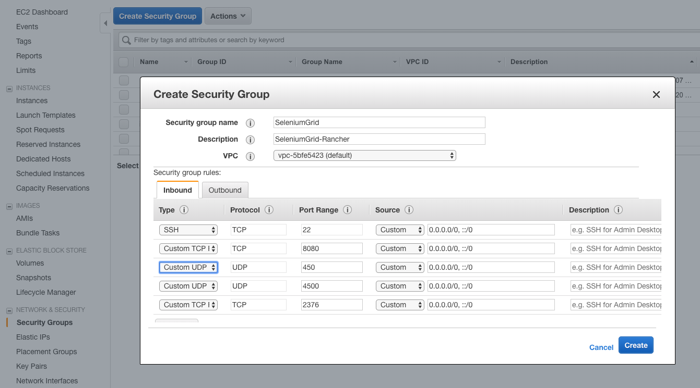
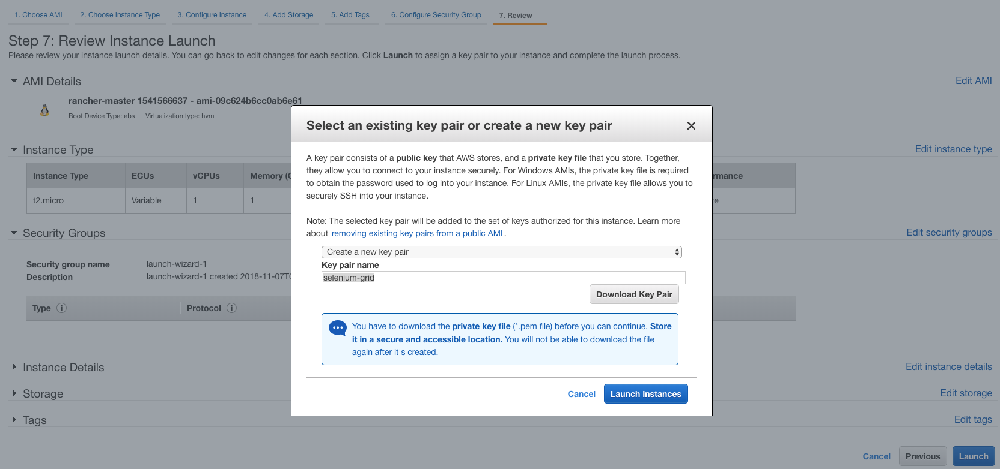
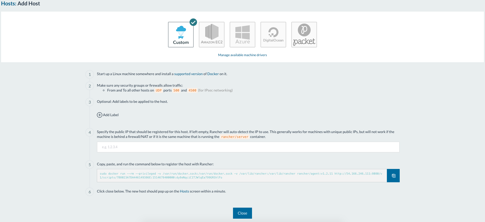
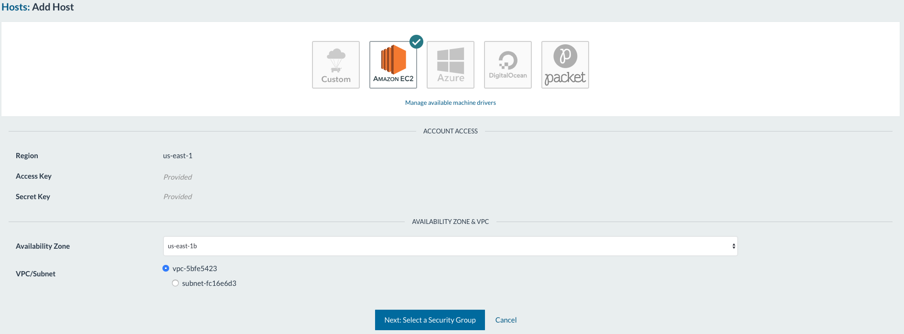
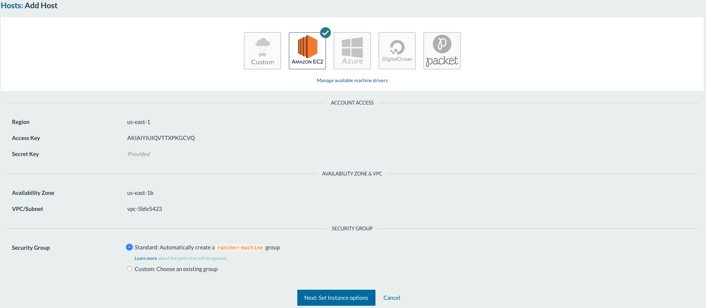
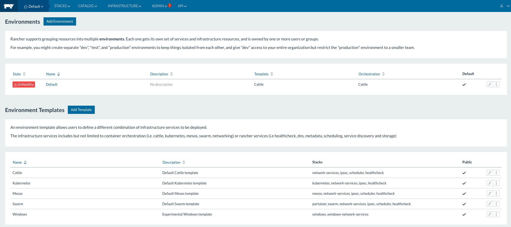
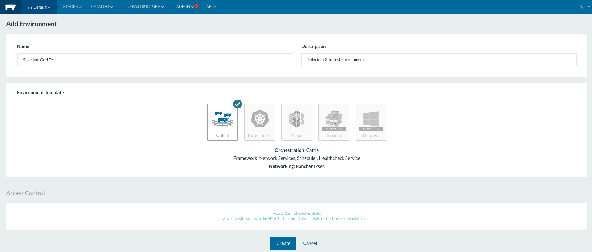

# Overview

In this blog, I will describe how I spin up a Selenium grid on AWS.

## What Is Selenium & Selenium Grid?

Selenium Grid is a part of the Selenium Suite that specializes in running multiple tests across different browsers, operating systems and machines in parallel.


Selenium Grid uses a hub-node concept where you only run the test on a single machine called a hub, but the execution will be done by different machines called nodes. 

### Selenium Grid Architecture
Selenium Grid has a Hub and Node Architecture.

#### The Hub

- The hub is the central point where the tests are loaded
- The hub is launched on a single machine and there is only one hub in a grid.
- The machine containing the hub is where the tests will be run, but you will see the browser being automated on the node.

#### The Nodes

- Nodes are one or more Selenium instances that will execute the tests that you loaded on the hub.
- Nodes can be launched on multiple machines with different platforms and browsers.
- The machines running the nodes need not be the same platform as that of the hub.

## Objectives
- Create AWS EC2 instance running Ubuntu 16.04.
- Ensure EC2 security group has port 8080, 22(in case if you need ssh), 2376, 450, 4500 open.
- Install Docker.
- Add Ubuntu user to docker group sudo usermod –append –groups docker ubuntu.
- Pull Rancher Server container image from Docker Store and run at startup.

---

### Identity Access Management (IAM)

#### Groups

We need to create Group to define policies like users to have EC2FullAccess rights.




#### Users

We need to create User for programmatic access and add this user to Group that we created above.




After you have created a User, the fourth page will generate an Access key ID and Secret access key used for AWS API, CLI, SDK and other development tools... Save these keys!

### Elastic Computing (EC2)

We need to create a security group and open ports below for inbound access to EC2 machines.

UDP 450, TCP 2376, UDP 4500, TCP 8080



---

## Amazon Machine Images (AMI) Creation for Rancher Server

In this blog, we will use [Packer](https://www.packer.io) to create the desired ubuntu machine image in AWS. Packer is an open source tool for creating identical machine images for multiple platforms from a single source configuration. Packer is lightweight, runs on every major operating system, and is highly performant, creating machine images for multiple platforms in parallel. Packer does not replace configuration management like Chef or Puppet. In fact, when building images, Packer is able to use tools like Chef or Puppet to install software onto the image.


### Installation

Centos: sudo yum install packer
MacOS: brew install packer (requires Homebrew to be installed)
Ubuntu: sudo apt-get update && sudo apt-get install packer
Windows: choco upgrade packer (requires Chocolatey to be installed)

### Verify Installation

	packer --version


### Build An Image

With Packer installed, we will build an Amazon EC2 image using a "t2.micro" instance (AWS free-tier)

### The Template

The configuration file used to define what image we want built and how is called a template in Packer terminology. The format of a template is simple JSON. 

We will start by creating the template which has the following sections variables, builders and provisioners.

Variables contains all the varibles.

Builders are responsible for creating machines and generating images from them for various platforms. In our case, we are configuring a single builder of type amazon-ebs. This is the Amazon EC2 AMI builder that ships with Packer. This builder builds an EBS-backed AMI by launching a source AMI, provisioning on top of that and re-packaging it into a new AMI. The additional keys within the object are configuration for this builder, specifying things such as access keys, the source AMI to build from and more. 

Provisioners use builtin and third-party software to install and configure the machine image after booting. Provisioners prepare the system for use, so common use cases for provisioners include tasks like installing packages or downloading application code. In our case, we will use the shell provisioner to get software installed and configured on a machine.

Create a file packer.json and fill the file with the following contents:

```
{
  "variables": {
    "aws_access_key": "",
    "aws_secret_key": ""
  },
  "builders": [{
    "type": "amazon-ebs",
    "access_key": "{{user `aws_access_key`}}",
    "secret_key": "{{user `aws_secret_key`}}",
    "region": "us-east-1",
    "source_ami_filter": {
      "filters": {
        "virtualization-type": "hvm",
        "name": "ubuntu/images/*ubuntu-xenial-16.04-amd64-server-*",
        "root-device-type": "ebs"
      },
      "owners": ["570294350858"],
      "most_recent": true
    },
    "instance_type": "t2.micro",
    "ssh_username": "ubuntu",
    "ami_name": "rancher-master {{timestamp}}",
    "shutdown_behavior": "stop"
  }],
  "provisioners": [{
    "type": "shell",
      "script": "provision.sh"
  }]
}
```

NOTE ONE: To validate the packer.json file, 

	Packer validate packer.json


### Docker Installation

The following script will be used to install Docker onto the Ubuntu image.

Create a file provision.sh and fill the file with the following contents:

```
#!/bin/sh
set -e

# This script is meant for quick & easy install via:
#   $ curl -fsSL get.docker.com -o get-docker.sh
#   $ sh get-docker.sh
#
# For test builds (ie. release candidates):
#   $ curl -fsSL test.docker.com -o test-docker.sh
#   $ sh test-docker.sh
#
# NOTE: Make sure to verify the contents of the script
#       you downloaded matches the contents of install.sh
#       located at https://github.com/docker/docker-install
#       before executing.
#
# Git commit from https://github.com/docker/docker-install when
# the script was uploaded (Should only be modified by upload job):
SCRIPT_COMMIT_SHA=UNKNOWN


# This value will automatically get changed for:
#   * edge
#   * test
#   * experimental
DEFAULT_CHANNEL_VALUE="test"
if [ -z "$CHANNEL" ]; then
	CHANNEL=$DEFAULT_CHANNEL_VALUE
fi

DEFAULT_DOWNLOAD_URL="https://download.docker.com"
if [ -z "$DOWNLOAD_URL" ]; then
	DOWNLOAD_URL=$DEFAULT_DOWNLOAD_URL
fi

DEFAULT_REPO_FILE="docker-ce.repo"
if [ -z "$REPO_FILE" ]; then
	REPO_FILE="$DEFAULT_REPO_FILE"
fi

SUPPORT_MAP="
x86_64-centos-7
x86_64-fedora-26
x86_64-fedora-27
x86_64-fedora-28
x86_64-debian-wheezy
x86_64-debian-jessie
x86_64-debian-stretch
x86_64-debian-buster
x86_64-ubuntu-trusty
x86_64-ubuntu-xenial
x86_64-ubuntu-bionic
x86_64-ubuntu-artful
s390x-ubuntu-xenial
s390x-ubuntu-bionic
s390x-ubuntu-artful
ppc64le-ubuntu-xenial
ppc64le-ubuntu-bionic
ppc64le-ubuntu-artful
aarch64-ubuntu-xenial
aarch64-ubuntu-bionic
aarch64-debian-jessie
aarch64-debian-stretch
aarch64-debian-buster
aarch64-fedora-26
aarch64-fedora-27
aarch64-fedora-28
aarch64-centos-7
armv6l-raspbian-jessie
armv7l-raspbian-jessie
armv6l-raspbian-stretch
armv7l-raspbian-stretch
armv7l-debian-jessie
armv7l-debian-stretch
armv7l-debian-buster
armv7l-ubuntu-trusty
armv7l-ubuntu-xenial
armv7l-ubuntu-bionic
armv7l-ubuntu-artful
"

mirror=''
DRY_RUN=${DRY_RUN:-}
while [ $# -gt 0 ]; do
	case "$1" in
		--mirror)
			mirror="$2"
			shift
			;;
		--dry-run)
			DRY_RUN=1
			;;
		--*)
			echo "Illegal option $1"
			;;
	esac
	shift $(( $# > 0 ? 1 : 0 ))
done

case "$mirror" in
	Aliyun)
		DOWNLOAD_URL="https://mirrors.aliyun.com/docker-ce"
		;;
	AzureChinaCloud)
		DOWNLOAD_URL="https://mirror.azure.cn/docker-ce"
		;;
esac

command_exists() {
	command -v "$@" > /dev/null 2>&1
}

is_dry_run() {
	if [ -z "$DRY_RUN" ]; then
		return 1
	else
		return 0
	fi
}

deprecation_notice() {
	distro=$1
	date=$2
	echo
	echo "DEPRECATION WARNING:"
	echo "    The distribution, $distro, will no longer be supported in this script as of $date."
	echo "    If you feel this is a mistake please submit an issue at https://github.com/docker/docker-install/issues/new"
	echo
	sleep 10
}

get_distribution() {
	lsb_dist=""
	# Every system that we officially support has /etc/os-release
	if [ -r /etc/os-release ]; then
		lsb_dist="$(. /etc/os-release && echo "$ID")"
	fi
	# Returning an empty string here should be alright since the
	# case statements don't act unless you provide an actual value
	echo "$lsb_dist"
}

add_debian_backport_repo() {
	debian_version="$1"
	backports="deb http://ftp.debian.org/debian $debian_version-backports main"
	if ! grep -Fxq "$backports" /etc/apt/sources.list; then
		(set -x; $sh_c "echo \"$backports\" >> /etc/apt/sources.list")
	fi
}

echo_docker_as_nonroot() {
	if is_dry_run; then
		return
	fi
	if command_exists docker && [ -e /var/run/docker.sock ]; then
		(
			set -x
			$sh_c 'docker version'
		) || true
	fi
	your_user=your-user
	[ "$user" != 'root' ] && your_user="$user"
	# intentionally mixed spaces and tabs here -- tabs are stripped by "<<-EOF", spaces are kept in the output
	echo "If you would like to use Docker as a non-root user, you should now consider"
	echo "adding your user to the \"docker\" group with something like:"
	echo
	echo "  sudo usermod -aG docker $your_user"
	echo
	echo "Remember that you will have to log out and back in for this to take effect!"
	echo
	echo "WARNING: Adding a user to the \"docker\" group will grant the ability to run"
	echo "         containers which can be used to obtain root privileges on the"
	echo "         docker host."
	echo "         Refer to https://docs.docker.com/engine/security/security/#docker-daemon-attack-surface"
	echo "         for more information."
	sudo docker pull rancher/server
    sudo docker run -d -p 8080:8080 --restart unless-stopped rancher/server

}

# Check if this is a forked Linux distro
check_forked() {

	# Check for lsb_release command existence, it usually exists in forked distros
	if command_exists lsb_release; then
		# Check if the `-u` option is supported
		set +e
		lsb_release -a -u > /dev/null 2>&1
		lsb_release_exit_code=$?
		set -e

		# Check if the command has exited successfully, it means we're in a forked distro
		if [ "$lsb_release_exit_code" = "0" ]; then
			# Print info about current distro
			cat <<-EOF
			You're using '$lsb_dist' version '$dist_version'.
			EOF

			# Get the upstream release info
			lsb_dist=$(lsb_release -a -u 2>&1 | tr '[:upper:]' '[:lower:]' | grep -E 'id' | cut -d ':' -f 2 | tr -d '[:space:]')
			dist_version=$(lsb_release -a -u 2>&1 | tr '[:upper:]' '[:lower:]' | grep -E 'codename' | cut -d ':' -f 2 | tr -d '[:space:]')

			# Print info about upstream distro
			cat <<-EOF
			Upstream release is '$lsb_dist' version '$dist_version'.
			EOF
		else
			if [ -r /etc/debian_version ] && [ "$lsb_dist" != "ubuntu" ] && [ "$lsb_dist" != "raspbian" ]; then
				if [ "$lsb_dist" = "osmc" ]; then
					# OSMC runs Raspbian
					lsb_dist=raspbian
				else
					# We're Debian and don't even know it!
					lsb_dist=debian
				fi
				dist_version="$(sed 's/\/.*//' /etc/debian_version | sed 's/\..*//')"
				case "$dist_version" in
					9)
						dist_version="stretch"
					;;
					8|'Kali Linux 2')
						dist_version="jessie"
					;;
					7)
						dist_version="wheezy"
					;;
				esac
			fi
		fi
	fi
}

semverParse() {
	major="${1%%.*}"
	minor="${1#$major.}"
	minor="${minor%%.*}"
	patch="${1#$major.$minor.}"
	patch="${patch%%[-.]*}"
}

ee_notice() {
	echo
	echo
	echo "  WARNING: $1 is now only supported by Docker EE"
	echo "           Check https://store.docker.com for information on Docker EE"
	echo
	echo
}

do_install() {
	echo "# Executing docker install script, commit: $SCRIPT_COMMIT_SHA"

	if command_exists docker; then
		docker_version="$(docker -v | cut -d ' ' -f3 | cut -d ',' -f1)"
		MAJOR_W=1
		MINOR_W=10

		semverParse "$docker_version"

		shouldWarn=0
		if [ "$major" -lt "$MAJOR_W" ]; then
			shouldWarn=1
		fi

		if [ "$major" -le "$MAJOR_W" ] && [ "$minor" -lt "$MINOR_W" ]; then
			shouldWarn=1
		fi

		cat >&2 <<-'EOF'
			Warning: the "docker" command appears to already exist on this system.
			If you already have Docker installed, this script can cause trouble, which is
			why we're displaying this warning and provide the opportunity to cancel the
			installation.
			If you installed the current Docker package using this script and are using it
		EOF

		if [ $shouldWarn -eq 1 ]; then
			cat >&2 <<-'EOF'
			again to update Docker, we urge you to migrate your image store before upgrading
			to v1.10+.
			You can find instructions for this here:
			https://github.com/docker/docker/wiki/Engine-v1.10.0-content-addressability-migration
			EOF
		else
			cat >&2 <<-'EOF'
			again to update Docker, you can safely ignore this message.
			EOF
		fi

		cat >&2 <<-'EOF'
			You may press Ctrl+C now to abort this script.
		EOF
		( set -x; sleep 20 )
	fi

	user="$(id -un 2>/dev/null || true)"

	sh_c='sh -c'
	if [ "$user" != 'root' ]; then
		if command_exists sudo; then
			sh_c='sudo -E sh -c'
		elif command_exists su; then
			sh_c='su -c'
		else
			cat >&2 <<-'EOF'
			Error: this installer needs the ability to run commands as root.
			We are unable to find either "sudo" or "su" available to make this happen.
			EOF
			exit 1
		fi
	fi

	if is_dry_run; then
		sh_c="echo"
	fi

	# perform some very rudimentary platform detection
	lsb_dist=$( get_distribution )
	lsb_dist="$(echo "$lsb_dist" | tr '[:upper:]' '[:lower:]')"

	case "$lsb_dist" in

		ubuntu)
			if command_exists lsb_release; then
				dist_version="$(lsb_release --codename | cut -f2)"
			fi
			if [ -z "$dist_version" ] && [ -r /etc/lsb-release ]; then
				dist_version="$(. /etc/lsb-release && echo "$DISTRIB_CODENAME")"
			fi
		;;

		debian|raspbian)
			dist_version="$(sed 's/\/.*//' /etc/debian_version | sed 's/\..*//')"
			case "$dist_version" in
				9)
					dist_version="stretch"
				;;
				8)
					dist_version="jessie"
				;;
				7)
					dist_version="wheezy"
				;;
			esac
		;;

		centos)
			if [ -z "$dist_version" ] && [ -r /etc/os-release ]; then
				dist_version="$(. /etc/os-release && echo "$VERSION_ID")"
			fi
		;;

		rhel|ol|sles)
			ee_notice "$lsb_dist"
			exit 1
			;;

		*)
			if command_exists lsb_release; then
				dist_version="$(lsb_release --release | cut -f2)"
			fi
			if [ -z "$dist_version" ] && [ -r /etc/os-release ]; then
				dist_version="$(. /etc/os-release && echo "$VERSION_ID")"
			fi
		;;

	esac

	# Check if this is a forked Linux distro
	check_forked

	# Check if we actually support this configuration
	if ! echo "$SUPPORT_MAP" | grep "$(uname -m)-$lsb_dist-$dist_version" >/dev/null; then
		cat >&2 <<-'EOF'
		Either your platform is not easily detectable or is not supported by this
		installer script.
		Please visit the following URL for more detailed installation instructions:
		https://docs.docker.com/engine/installation/
		EOF
		exit 1
	fi

	# Run setup for each distro accordingly
	case "$lsb_dist" in
		ubuntu|debian|raspbian)
			pre_reqs="apt-transport-https ca-certificates curl"
			if [ "$lsb_dist" = "debian" ]; then
				if [ "$dist_version" = "wheezy" ]; then
					add_debian_backport_repo "$dist_version"
				fi
				# libseccomp2 does not exist for debian jessie main repos for aarch64
				if [ "$(uname -m)" = "aarch64" ] && [ "$dist_version" = "jessie" ]; then
					add_debian_backport_repo "$dist_version"
				fi
			fi

			# TODO: August 31, 2018 delete from here,
			if [ "$lsb_dist" =  "ubuntu" ] && [ "$dist_version" = "artful" ]; then
				deprecation_notice "$lsb_dist $dist_version" "August 31, 2018"
			fi
			# TODO: August 31, 2018 delete to here,

			if ! command -v gpg > /dev/null; then
				pre_reqs="$pre_reqs gnupg"
			fi
			apt_repo="deb [arch=$(dpkg --print-architecture)] $DOWNLOAD_URL/linux/$lsb_dist $dist_version $CHANNEL"
			(
				if ! is_dry_run; then
					set -x
				fi
				$sh_c 'apt-get update -qq >/dev/null'
				$sh_c "apt-get install -y -qq $pre_reqs >/dev/null"
				$sh_c "curl -fsSL \"$DOWNLOAD_URL/linux/$lsb_dist/gpg\" | apt-key add -qq - >/dev/null"
				$sh_c "echo \"$apt_repo\" > /etc/apt/sources.list.d/docker.list"
				if [ "$lsb_dist" = "debian" ] && [ "$dist_version" = "wheezy" ]; then
					$sh_c 'sed -i "/deb-src.*download\.docker/d" /etc/apt/sources.list.d/docker.list'
				fi
				$sh_c 'apt-get update -qq >/dev/null'
			)
			pkg_version=""
			if [ ! -z "$VERSION" ]; then
				if is_dry_run; then
					echo "# WARNING: VERSION pinning is not supported in DRY_RUN"
				else
					# Will work for incomplete versions IE (17.12), but may not actually grab the "latest" if in the test channel
					pkg_pattern="$(echo "$VERSION" | sed "s/-ce-/~ce~.*/g" | sed "s/-/.*/g").*-0~$lsb_dist"
					search_command="apt-cache madison 'docker-ce' | grep '$pkg_pattern' | head -1 | cut -d' ' -f 4"
					pkg_version="$($sh_c "$search_command")"
					echo "INFO: Searching repository for VERSION '$VERSION'"
					echo "INFO: $search_command"
					if [ -z "$pkg_version" ]; then
						echo
						echo "ERROR: '$VERSION' not found amongst apt-cache madison results"
						echo
						exit 1
					fi
					pkg_version="=$pkg_version"
				fi
			fi
			(
				if ! is_dry_run; then
					set -x
				fi
				$sh_c "apt-get install -y -qq --no-install-recommends docker-ce$pkg_version >/dev/null"
			)
			echo_docker_as_nonroot
			exit 0
			;;
		centos|fedora)
			yum_repo="$DOWNLOAD_URL/linux/$lsb_dist/$REPO_FILE"
			if ! curl -Ifs "$yum_repo" > /dev/null; then
				echo "Error: Unable to curl repository file $yum_repo, is it valid?"
				exit 1
			fi
			if [ "$lsb_dist" = "fedora" ]; then
				if [ "$dist_version" -lt "26" ]; then
					echo "Error: Only Fedora >=26 are supported"
					exit 1
				fi

				pkg_manager="dnf"
				config_manager="dnf config-manager"
				enable_channel_flag="--set-enabled"
				pre_reqs="dnf-plugins-core"
				pkg_suffix="fc$dist_version"
			else
				pkg_manager="yum"
				config_manager="yum-config-manager"
				enable_channel_flag="--enable"
				pre_reqs="yum-utils"
				pkg_suffix="el"
			fi
			(
				if ! is_dry_run; then
					set -x
				fi
				$sh_c "$pkg_manager install -y -q $pre_reqs"
				$sh_c "$config_manager --add-repo $yum_repo"

				if [ "$CHANNEL" != "stable" ]; then
					$sh_c "$config_manager $enable_channel_flag docker-ce-$CHANNEL"
				fi
				$sh_c "$pkg_manager makecache"
			)
			pkg_version=""
			if [ ! -z "$VERSION" ]; then
				if is_dry_run; then
					echo "# WARNING: VERSION pinning is not supported in DRY_RUN"
				else
					pkg_pattern="$(echo "$VERSION" | sed "s/-ce-/\\\\.ce.*/g" | sed "s/-/.*/g").*$pkg_suffix"
					search_command="$pkg_manager list --showduplicates 'docker-ce' | grep '$pkg_pattern' | tail -1 | awk '{print \$2}'"
					pkg_version="$($sh_c "$search_command")"
					echo "INFO: Searching repository for VERSION '$VERSION'"
					echo "INFO: $search_command"
					if [ -z "$pkg_version" ]; then
						echo
						echo "ERROR: '$VERSION' not found amongst $pkg_manager list results"
						echo
						exit 1
					fi
					# Cut out the epoch and prefix with a '-'
					pkg_version="-$(echo "$pkg_version" | cut -d':' -f 2)"
				fi
			fi
			(
				if ! is_dry_run; then
					set -x
				fi
				$sh_c "$pkg_manager install -y -q docker-ce$pkg_version"
			)
			echo_docker_as_nonroot
			exit 0
			;;
	esac
	exit 1
}

# wrapped up in a function so that we have some protection against only getting
# half the file during "curl | sh"
do_install


```

### Execute Packer

Execute packer with packer.json, you'll pass in aws_access_key and aws_secret_key as user variables, keeping your secret keys out of the template.

	packer build -var ‘aws_access_key=<aws_access_key> -var ‘aws_secret_key=<aws_secret_key>’ packer.json


The following is the terminal output of pulling the rancher server contianer image and running the provision.sh script:

```
amazon-ebs output will be in this color.

==> amazon-ebs: Prevalidating AMI Name: rancher-master 1541566637
    amazon-ebs: Found Image ID: ami-0735ea082a1534cac
==> amazon-ebs: Creating temporary keypair: packer_5be270ae-f207-a5c6-625f-421a081bfe27
==> amazon-ebs: Creating temporary security group for this instance: packer_5be270b0-edd1-1b91-c914-324f34d70621
==> amazon-ebs: Authorizing access to port 22 from 0.0.0.0/0 in the temporary security group...
==> amazon-ebs: Launching a source AWS instance...
==> amazon-ebs: Adding tags to source instance
    amazon-ebs: Adding tag: "Name": "Packer Builder"
    amazon-ebs: Instance ID: i-0647787a443897e4c
==> amazon-ebs: Waiting for instance (i-0647787a443897e4c) to become ready...
==> amazon-ebs: Using ssh communicator to connect: 18.208.161.184
==> amazon-ebs: Waiting for SSH to become available...
==> amazon-ebs: Connected to SSH!
==> amazon-ebs: Provisioning with shell script: provision.sh
    amazon-ebs: # Executing docker install script, commit: UNKNOWN
    amazon-ebs: + sudo -E sh -c apt-get update -qq >/dev/null
    amazon-ebs: + sudo -E sh -c apt-get install -y -qq apt-transport-https ca-certificates curl >/dev/null
    amazon-ebs: debconf: DbDriver "config": /var/cache/debconf/config.dat is locked by another process: Resource temporarily unavailable
    amazon-ebs: + sudo -E sh -c curl -fsSL "https://download.docker.com/linux/ubuntu/gpg" | apt-key add -qq - >/dev/null
    amazon-ebs: + sudo -E sh -c echo "deb [arch=amd64] https://download.docker.com/linux/ubuntu xenial test" > /etc/apt/sources.list.d/docker.list
    amazon-ebs: + [ ubuntu = debian ]
    amazon-ebs: + sudo -E sh -c apt-get update -qq >/dev/null
    amazon-ebs: + sudo -E sh -c apt-get install -y -qq --no-install-recommends docker-ce >/dev/null
    amazon-ebs: debconf: unable to initialize frontend: Dialog
    amazon-ebs: debconf: (Dialog frontend will not work on a dumb terminal, an emacs shell buffer, or without a controlling terminal.)
    amazon-ebs: debconf: falling back to frontend: Readline
    amazon-ebs: debconf: unable to initialize frontend: Readline
    amazon-ebs: debconf: (This frontend requires a controlling tty.)
    amazon-ebs: debconf: falling back to frontend: Teletype
    amazon-ebs: dpkg-preconfigure: unable to re-open stdin:
    amazon-ebs: + sudo -E sh -c docker version
    amazon-ebs: Client:
    amazon-ebs:  Version:           18.09.0-rc1
    amazon-ebs:  API version:       1.39
    amazon-ebs:  Go version:        go1.10.4
    amazon-ebs:  Git commit:        6e632f7
    amazon-ebs:  Built:             Thu Nov  1 05:46:26 2018
    amazon-ebs:  OS/Arch:           linux/amd64
    amazon-ebs:  Experimental:      false
    amazon-ebs:
    amazon-ebs: Server: Docker Engine - Community
    amazon-ebs:  Engine:
    amazon-ebs:   Version:          18.09.0-rc1
    amazon-ebs:   API version:      1.39 (minimum version 1.12)
    amazon-ebs:   Go version:       go1.10.4
    amazon-ebs:   Git commit:       6e632f7
    amazon-ebs:   Built:            Thu Nov  1 05:14:10 2018
    amazon-ebs:   OS/Arch:          linux/amd64
    amazon-ebs:   Experimental:     false
    amazon-ebs: If you would like to use Docker as a non-root user, you should now consider
    amazon-ebs: adding your user to the "docker" group with something like:
    amazon-ebs:
    amazon-ebs:   sudo usermod -aG docker ubuntu
    amazon-ebs:
    amazon-ebs: Remember that you will have to log out and back in for this to take effect!
    amazon-ebs:
    amazon-ebs: WARNING: Adding a user to the "docker" group will grant the ability to run
    amazon-ebs:          containers which can be used to obtain root privileges on the
    amazon-ebs:          docker host.
    amazon-ebs:          Refer to https://docs.docker.com/engine/security/security/#docker-daemon-attack-surface
    amazon-ebs:          for more information.
    amazon-ebs: Using default tag: latest
    amazon-ebs: latest: Pulling from rancher/server
    amazon-ebs: bae382666908: Pulling fs layer
    amazon-ebs: 29ede3c02ff2: Pulling fs layer
    amazon-ebs: da4e69f33106: Pulling fs layer
    amazon-ebs: 8d43e5f5d27f: Pulling fs layer
    amazon-ebs: b0de1abb17d6: Pulling fs layer
    amazon-ebs: 422f47db4517: Pulling fs layer
    amazon-ebs: 79d37de643ce: Pulling fs layer
    amazon-ebs: 69d13e08a4fe: Pulling fs layer
    amazon-ebs: 2ddfd3c6a2b7: Pulling fs layer
    amazon-ebs: bc433fed3823: Pulling fs layer
    amazon-ebs: b82e188df556: Pulling fs layer
    amazon-ebs: dae2802428a4: Pulling fs layer
    amazon-ebs: c9b17cca6fc4: Pulling fs layer
    amazon-ebs: 41cc2c1ffe8c: Pulling fs layer
    amazon-ebs: ae49123ce3ae: Pulling fs layer
    amazon-ebs: 2fe8cae58437: Pulling fs layer
    amazon-ebs: ab963aad4fc2: Pulling fs layer
    amazon-ebs: 2dd932ceaa80: Pulling fs layer
    amazon-ebs: 7117c2294aff: Pulling fs layer
    amazon-ebs: deba74d56bbb: Pulling fs layer
    amazon-ebs: 9fd6e4e1d44c: Pulling fs layer
    amazon-ebs: 8d43e5f5d27f: Waiting
    amazon-ebs: b0de1abb17d6: Waiting
    amazon-ebs: 422f47db4517: Waiting
    amazon-ebs: 79d37de643ce: Waiting
    amazon-ebs: 69d13e08a4fe: Waiting
    amazon-ebs: 2ddfd3c6a2b7: Waiting
    amazon-ebs: bc433fed3823: Waiting
    amazon-ebs: b82e188df556: Waiting
    amazon-ebs: dae2802428a4: Waiting
    amazon-ebs: c9b17cca6fc4: Waiting
    amazon-ebs: 41cc2c1ffe8c: Waiting
    amazon-ebs: ae49123ce3ae: Waiting
    amazon-ebs: 2fe8cae58437: Waiting
    amazon-ebs: ab963aad4fc2: Waiting
    amazon-ebs: 2dd932ceaa80: Waiting
    amazon-ebs: 7117c2294aff: Waiting
    amazon-ebs: deba74d56bbb: Waiting
    amazon-ebs: 9fd6e4e1d44c: Waiting
    amazon-ebs: da4e69f33106: Verifying Checksum
    amazon-ebs: da4e69f33106: Download complete
    amazon-ebs: 29ede3c02ff2: Verifying Checksum
    amazon-ebs: 29ede3c02ff2: Download complete
    amazon-ebs: 8d43e5f5d27f: Verifying Checksum
    amazon-ebs: 8d43e5f5d27f: Download complete
    amazon-ebs: b0de1abb17d6: Verifying Checksum
    amazon-ebs: b0de1abb17d6: Download complete
    amazon-ebs: 79d37de643ce: Verifying Checksum
    amazon-ebs: 79d37de643ce: Download complete
    amazon-ebs: 422f47db4517: Verifying Checksum
    amazon-ebs: 422f47db4517: Download complete
    amazon-ebs: 69d13e08a4fe: Verifying Checksum
    amazon-ebs: 69d13e08a4fe: Download complete
    amazon-ebs: 2ddfd3c6a2b7: Verifying Checksum
    amazon-ebs: 2ddfd3c6a2b7: Download complete
    amazon-ebs: b82e188df556: Verifying Checksum
    amazon-ebs: b82e188df556: Download complete
    amazon-ebs: bae382666908: Verifying Checksum
    amazon-ebs: bae382666908: Download complete
    amazon-ebs: dae2802428a4: Verifying Checksum
    amazon-ebs: dae2802428a4: Download complete
    amazon-ebs: c9b17cca6fc4: Verifying Checksum
    amazon-ebs: c9b17cca6fc4: Download complete
    amazon-ebs: bc433fed3823: Verifying Checksum
    amazon-ebs: bc433fed3823: Download complete
    amazon-ebs: 41cc2c1ffe8c: Verifying Checksum
    amazon-ebs: 41cc2c1ffe8c: Download complete
    amazon-ebs: ae49123ce3ae: Verifying Checksum
    amazon-ebs: ae49123ce3ae: Download complete
    amazon-ebs: 2fe8cae58437: Verifying Checksum
    amazon-ebs: 2fe8cae58437: Download complete
    amazon-ebs: ab963aad4fc2: Verifying Checksum
    amazon-ebs: ab963aad4fc2: Download complete
    amazon-ebs: 2dd932ceaa80: Verifying Checksum
    amazon-ebs: 2dd932ceaa80: Download complete
    amazon-ebs: bae382666908: Pull complete
    amazon-ebs: 29ede3c02ff2: Pull complete
    amazon-ebs: 7117c2294aff: Verifying Checksum
    amazon-ebs: 7117c2294aff: Download complete
    amazon-ebs: da4e69f33106: Pull complete
    amazon-ebs: 8d43e5f5d27f: Pull complete
    amazon-ebs: 9fd6e4e1d44c: Verifying Checksum
    amazon-ebs: 9fd6e4e1d44c: Download complete
    amazon-ebs: b0de1abb17d6: Pull complete
    amazon-ebs: 422f47db4517: Pull complete
    amazon-ebs: 79d37de643ce: Pull complete
    amazon-ebs: 69d13e08a4fe: Pull complete
    amazon-ebs: 2ddfd3c6a2b7: Pull complete
    amazon-ebs: deba74d56bbb: Verifying Checksum
    amazon-ebs: deba74d56bbb: Download complete
    amazon-ebs: bc433fed3823: Pull complete
    amazon-ebs: b82e188df556: Pull complete
    amazon-ebs: dae2802428a4: Pull complete
    amazon-ebs: c9b17cca6fc4: Pull complete
    amazon-ebs: 41cc2c1ffe8c: Pull complete
    amazon-ebs: ae49123ce3ae: Pull complete
    amazon-ebs: 2fe8cae58437: Pull complete
    amazon-ebs: ab963aad4fc2: Pull complete
    amazon-ebs: 2dd932ceaa80: Pull complete
    amazon-ebs: 7117c2294aff: Pull complete
    amazon-ebs: deba74d56bbb: Pull complete
    amazon-ebs: 9fd6e4e1d44c: Pull complete
    amazon-ebs: Digest: sha256:036dac0b0e322c94714613def5d07f23c357cc5904ad1ee93b4187439d375185
    amazon-ebs: Status: Downloaded newer image for rancher/server:latest
    amazon-ebs: f4da6f32386571c92433b5d587bbe70d22ab36f555cbf5a03d60fba191f3c18d
==> amazon-ebs: Stopping the source instance...
    amazon-ebs: Stopping instance, attempt 1
==> amazon-ebs: Waiting for the instance to stop...
==> amazon-ebs: Creating unencrypted AMI rancher-master 1541566637 from instance i-0647787a443897e4c
    amazon-ebs: AMI: ami-09c624b6cc0ab6e61
==> amazon-ebs: Waiting for AMI to become ready...
==> amazon-ebs: Terminating the source AWS instance...
==> amazon-ebs: Cleaning up any extra volumes...
==> amazon-ebs: No volumes to clean up, skipping
==> amazon-ebs: Deleting temporary security group...
==> amazon-ebs: Deleting temporary keypair...
Build 'amazon-ebs' finished.

==> Builds finished. The artifacts of successful builds are:
--> amazon-ebs: AMIs were created:
us-east-1: ami-09c624b6cc0ab6e61

```

### Choose AMI

In the AWS web console, select the EC2 dashboard. On the right hand side under images, click on the AMIs tab.  Select the rancher-master image and click on Launch button.


### Choose Instance Type

Select the t2.micro (free tier elidible) and click on the Review and Launch button.


### Review

Review the information and click on the Launch button.


A window will pop up abd ask for a key pair. In our case, we will make a new key pair called slenium-grid. Click the Download Key Pair button and save the .pem file to a safe and secure location as you will not be able to download it a second time.



Once the key pair .pem file is download, click on the Launch Instances button.

### Status 


### Verify the Docker contianer on the EC2 host

Select the Instances tab and wait for the instance to be ready. The EC2 machine will boot up and run rancher server container on port 8080. This can approximately take 3-5 minutes.

NOTE: Ensure the security group associated to the EC2 instance is SeleniumGrid

Once the Instance State is running, I will connect to the EC2 instance using SSH.

Open your command line shell and change the folder to the location of the .pem key pair file.

Use the chmod command to make sure your .pem key pair file isn't publicly viewable:

	chmod 400 key-pair.pem

Use the following SSH command to connect to the instance:

	ssh -i /path/my-key-pair.pem ubuntu@public_dns_name

Note: You can get the public DNS for your instance using the Amazon EC2 console. (If the Public DNS column is hidden, choose the Show/Hide icon.)


Once you have connected to the EC2 instance, type in the following command:

	sudo docker ps

You should see output similar to the following:


### Welcome to Rancher

In a brower, navigate to http://<{Ipv4 public IP Address}>:8080.


### Add a Host

Host machines will cover your infrastructure resources with containers will be running on these hosts and automatically distributed.

Click on the Add a host link


Then click on the Save button


Select the Amazone EC2 icon



Enter the account information (region, access key and secret key) and click the Next: Authenticate & select a network button


Fill in the the availabilty zone and VPC and click the Next: Select a Security Group button






I selected host quantity as 3 and it’s going to provision 3 Ubuntu t2.micro 16GB disk mounted AMIs on EC2.


### Environment and Stack

Under the Default tab, select Management Environments.



Click on the Add Environment button, enter a name and description in the text boxes and click on the Creat button



Select the STACKS tab 


Click on the Add Stack button, enter a name, description, and the following yml text information in the each text box and click on the Creat button.

Docker-compose.yml contents:

```
version: '2'
services:
  Chrome:
    image: selenium/node-chrome
    stdin_open: true
    tty: true
    links:
    - SeleniumHub:Hub
    labels:
      io.rancher.container.pull_image: always
  firefox:
    image: selenium/node-firefox
    stdin_open: true
    tty: true
    links:
    - SeleniumHub:Hub
    labels:
      io.rancher.container.pull_image: always
  SeleniumHub:
    image: selenium/hub
    stdin_open: true
    tty: true
    ports:
    - 4444:4444/tcp
    labels:
      io.rancher.container.pull_image: always
```

rancher-compose.yml contents:

```
version: '2'
services:
  Chrome:
    scale: 1
    start_on_create: true
  firefox:
    scale: 1
    start_on_create: true
  SeleniumHub:
    scale: 1
    start_on_create: true

```

The yml files adds services for creating SeleniumGrid Stack:

1 container for Selenium Hub
1 container for Chrome Node
1 container for Firefox Node

NOTE: This could be done manually if desired.

Wait for the stack to be ready and active.

Unhealthy stacks


Healthy stacks


Selenium Grid Container Information:


NOTE: If you want to scale out services of WebDrivers increase Scale count

Selenium Grid Dashbaord:

As you can see Selenium Hub is attached with one Chrome and one Firefox WebDriver instance.


# Conclusion

Spinning up a Selenium Grid architecture quite painless if one uses tools like Packer, Rancher and AWS.
